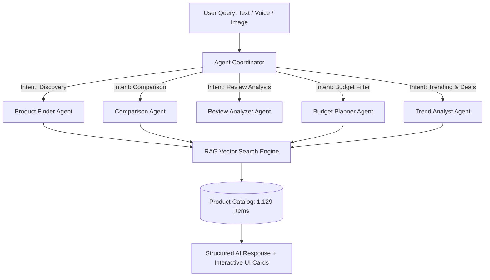

# ShopSmart AI 🛍️🤖

> **A Production-Ready AI Shopping Agent Web Application**  
> An intelligent shopping assistant that helps users discover, compare, analyze, and purchase products using AI. Built with a modern UI, real-time product recommendations, price comparison, review sentiment intelligence, wishlist management, and multi-agent conversational AI.

---

## 📸 Screenshots & UI Aesthetics
The user interface matches the design system and layouts from the project specifications:
- **Left/Right Split Authentication**: Modern hero with shopping illustrations, feature badges, password strength meter, and quick 1-click demo logins.
- **Home Dashboard**: Personalized greeting (`Welcome back, Sammya!`), AI Hero Concierge banner with prompt input, quick action cards, recent search pills, recommended products grid, and trending products sidebar.
- **AI Shopping Assistant**: Conversational agent chat with multi-turn history, interactive product carousel cards inside chat bubbles, suggested follow-up query chips, speech synthesis voice readout, speech-to-text mic input, and image-based shopping modal.
- **Product Search & Discovery**: Faceted search with real-time price slider, brand & category checkboxes, rating filters, sort dropdown, and semantic natural language search.
- **Product Details Page**: Photo gallery, pricing with strike-through discounts, key spec chips, right-hand AI Summary card with recommendation score (e.g., `8.5/10`), NLP Sentiment Breakdown (Positive %, Negative %, Advantages, Complaints), and interactive Chart.js 6-month price history graph.
- **Compare Products**: Side-by-side technical specification matrix, Chart.js radar benchmark chart, and AI Verdict badges (Top Pick, Best Value, Best Performance).
- **Smart Wishlist**: Saved products, target price setter, price drop detection, and celebration confetti on checkout.
- **Price Tracker**: Historical price fluctuations with lowest/highest markers, discount forecasts, and active price drop alerts.
- **Profile & Settings**: Account statistics, dark/light theme toggle, currency switch (₹ INR / $ USD), and personalized AI memory preferences (favorite brands, default budget range).
- **Admin & Analytics Dashboard**: Gross revenue analytics, monthly sales growth bar chart, AI agent workload doughnut chart, and product catalog CRUD management.

---

## 🛠️ Tech Stack

### Frontend
- **React.js 19** + **Vite 6**
- **Tailwind CSS v4** (Modern CSS design tokens & glassmorphism)
- **Chart.js** + **react-chartjs-2** (Interactive Line charts, Radar benchmarks, Sales Bar charts, Agent Doughnut charts)
- **Lucide React** (Modern iconography)
- **Canvas Confetti** (Micro-delight celebration animations)
- **Web Speech API** (Speech Recognition & Speech Synthesis)

### Backend
- **FastAPI** (Python 3.11 asynchronous web framework)
- **SQLAlchemy 2.0** (ORM supporting PostgreSQL and SQLite)
- **Pydantic v2** & **Pydantic Settings** (Data validation & schemas)
- **PyJWT** & **Bcrypt** (Secure JWT token authentication & salted password hashing)
- **Uvicorn** (Lightning-fast ASGI production server)

### AI & Vector Search / RAG
- **RAG Vector Search Engine** (`scikit-learn` TF-IDF Vectorizer + Cosine Similarity semantic index over 1,000+ items)
- **Multi-Agent AI System**:
  - `Product Finder Agent`: Semantic discovery & parametric constraints
  - `Comparison Agent`: Multi-product spec matrices & AI verdicts
  - `Review Analyzer Agent`: NLP sentiment classification & pros/cons extraction
  - `Budget Planner Agent`: Strict budget constraint optimization & savings calculation
  - `Trend Analyst Agent`: Market demand & price drop analytics
- **Multimodal Visual Shopping**: Image dominant color & feature classification with visual catalog matching.
- **Optional Live LLM Integration**: Automatic fallback multi-agent rule engine out-of-the-box, with plug-and-play support for Groq (`GROQ_API_KEY`), Gemini (`GEMINI_API_KEY`), or OpenAI (`OPENAI_API_KEY`). Groq is preferred when configured.

---

## 📂 Project Structure

```text
ShopSmart AI/
├── backend/
│   ├── app/
│   │   ├── __init__.py
│   │   ├── main.py                  # FastAPI app entrypoint, CORS, lifespan startup
│   │   ├── config.py                # App configuration & environment variables
│   │   ├── database.py              # SQLAlchemy engine & session setup
│   │   ├── models.py                # User, Product, Review, Wishlist, PriceHistory, etc.
│   │   ├── schemas.py               # Pydantic v2 request & response schemas
│   │   ├── auth.py                  # JWT creation, Bcrypt verification & dependencies
│   │   ├── agents/
│   │   │   ├── agent_coordinator.py # Intent classifier & multi-agent dispatcher
│   │   │   ├── product_finder.py    # Product Finder Agent
│   │   │   ├── comparison_agent.py  # Comparison Agent
│   │   │   ├── review_analyzer.py   # Review Analyzer Agent
│   │   │   ├── budget_planner.py    # Budget Planner Agent
│   │   │   └── trend_analyst.py     # Trend Analyst Agent
│   │   ├── rag/
│   │   │   ├── embeddings.py        # VectorSearchEngine (TF-IDF + Cosine similarity)
│   │   │   └── rag_service.py       # RAG context retriever & product similarity
│   │   ├── routers/
│   │   │   ├── auth.py              # /api/auth (register, login, me, preferences)
│   │   │   ├── products.py          # /api/products (list, filters, recommended, detail)
│   │   │   ├── chat.py              # /api/chat (multi-agent chatbot queries)
│   │   │   ├── compare.py           # /api/compare (side-by-side matrices & charts)
│   │   │   ├── reviews.py           # /api/reviews (review retrieval & sentiment)
│   │   │   ├── wishlist.py          # /api/wishlist (add, remove, target price alerts)
│   │   │   ├── price_tracker.py     # /api/price-tracker (history, predictions)
│   │   │   ├── vision.py            # /api/vision/search (image-based shopping)
│   │   │   └── admin.py             # /api/admin (metrics, catalog CRUD, AI logs)
│   │   └── data/
│   │       └── seed_products.py     # 1,129+ realistic products, price histories & reviews
│   ├── Dockerfile
│   └── requirements.txt
├── frontend/
│   ├── src/
│   │   ├── components/
│   │   │   ├── Sidebar.jsx          # Left navigation bar matching UI mockups
│   │   │   ├── Navbar.jsx           # Top global search, voice/camera icons, alerts
│   │   │   ├── ProductCard.jsx      # Product card with price formatting, ratings, wishlist
│   │   │   ├── PriceGraph.jsx       # Chart.js line graph of 6-month historical prices
│   │   │   ├── VoiceAssistantModal.jsx # Web Speech API voice shopping modal
│   │   │   └── ImageSearchModal.jsx # Drag-and-drop & preset visual shopping modal
│   │   ├── context/
│   │   │   ├── AuthContext.jsx      # User session & preferences management
│   │   │   ├── ThemeContext.jsx     # Dark/light mode & currency (INR/USD) formatter
│   │   │   └── CartWishlistContext.jsx # Wishlist, comparison queue, confetti
│   │   ├── pages/
│   │   │   ├── HomePage.jsx         # Dashboard matching mockup screenshot
│   │   │   ├── AssistantPage.jsx    # Conversational AI Shopping Assistant
│   │   │   ├── ProductsPage.jsx     # Faceted product search & filters
│   │   │   ├── ProductDetailPage.jsx# Product detail, specs, AI summary, sentiment
│   │   │   ├── ComparePage.jsx      # Side-by-side specs, radar chart & AI verdict
│   │   │   ├── WishlistPage.jsx     # Saved items, target price alerts, share modal
│   │   │   ├── PriceTrackerPage.jsx # 6-month price trends & AI predictions
│   │   │   ├── OrdersPage.jsx       # Order history & verified savings
│   │   │   ├── ProfilePage.jsx      # User profile & personalized AI memory
│   │   │   ├── AdminPage.jsx        # Admin metrics, charts, catalog management
│   │   │   └── AuthPage.jsx         # Split screen Login & Register
│   │   ├── services/
│   │   │   └── api.js               # Client API integration
│   │   ├── App.jsx                  # Root layout & page routing
│   │   └── index.css                # Tailwind v4 stylesheet
│   ├── index.html                   # HTML template with Google Fonts & favicon
│   ├── vite.config.js               # Vite config with Tailwind plugin & API proxy
│   ├── nginx.conf                   # Nginx reverse proxy for production build
│   └── Dockerfile
├── docker-compose.yml               # Multi-container PostgreSQL, Backend, Frontend
└── README.md
```

---

## ⚡ Quick Start

### 1. Run with Docker Compose (Recommended for Production)
```bash
docker-compose up --build
```
- Frontend will be available at: `http://localhost`
- Backend API will be available at: `http://localhost:8000`
- API documentation: `http://localhost:8000/docs`

---

### 2. Run Locally (Development Mode)

#### Backend Setup
```bash
cd backend

# Create virtual environment (Python 3.11)
python -m venv .venv
source .venv/bin/activate  # On Windows: .venv\Scripts\activate

# Install dependencies
pip install -r requirements.txt

# Seed the database with 1,129+ realistic products, price histories & reviews
python -m app.data.seed_products

# Start FastAPI server
uvicorn app.main:app --host 127.0.0.1 --port 8000 --reload
```

#### Frontend Setup
```bash
cd frontend

# Install npm dependencies
npm install

# Start Vite dev server
npm run dev
```
Open **`http://localhost:5173`** in your browser!

---

## 🔑 Demo Credentials

| Role | Email | Password | Features |
| :--- | :--- | :--- | :--- |
| **Demo Shopper** | `sammya@shopsmart.ai` | `password123` | Preloaded wishlist, search history, orders, personalized AI memory |
| **Administrator** | `admin@shopsmart.ai` | `admin123` | Full access to Admin Dashboard, catalog CRUD, telemetry logs |

*(You can also click the 1-click **"Demo Shopper"** or **"Admin Access"** buttons on the Login page for instant login!)*

---

## 🧠 Multi-Agent Architecture

The backend implements an **Agent Coordinator** pattern that dynamically classifies intent and dispatches queries to specialized sub-agents:



1. **Product Finder Agent**: Discovers items matching natural language semantics (e.g., *"lightweight laptop for coding"*, *"affordable smartwatch with calling"*).
2. **Comparison Agent**: Parses multiple items, builds a side-by-side spec comparison matrix, produces radar benchmark data, and renders an **AI Verdict** (Winner, Best Value, Best Performance).
3. **Review Analyzer Agent**: Gathers customer reviews, performs NLP sentiment analysis, and computes **Positive Sentiment %**, **Negative Sentiment %**, **Top Pros**, **Top Cons**, and **AI Recommendation Score**.
4. **Budget Planner Agent**: Strictly constrains search within target price limits (e.g., *"best gaming laptop under ₹80,000"*, *"gifts under ₹2,000"*), computing savings off MRP.
5. **Trend Analyst Agent**: Identifies top trending items with surging buyer interest and steep price cuts.

---

## 🚀 Deployment Guide

### Deploying Frontend to Vercel
1. Set the root directory to `frontend`.
2. Framework Preset: `Vite`.
3. Build Command: `npm run build`.
4. Output Directory: `dist`.
5. Environment Variable:
   - Set `VITE_API_URL` to your live backend URL (e.g., `https://shopsmart-backend.onrender.com`).

### Deploying Backend to Render / AWS / Railway
1. Set the root directory to `backend`.
2. Environment: `Python 3.11`.
3. Build Command: `pip install -r requirements.txt && python -m app.data.seed_products`.
4. Start Command: `uvicorn app.main:app --host 0.0.0.0 --port $PORT`.
5. Environment Variables:
   - `DATABASE_URL`: PostgreSQL connection URI (e.g. `postgresql://...`). If not provided, defaults to local SQLite.
   - `SECRET_KEY`: Secure secret key for JWT signing.
   - `GROQ_API_KEY`, `GEMINI_API_KEY`, or `OPENAI_API_KEY`: *(Optional)* for live LLM response enrichment. Groq takes precedence when multiple keys are configured.

For local development and Docker Compose, copy `.env.example` to `.env` in the project root and set `GROQ_API_KEY` there. Do not commit `.env` or share its contents.

---

## 📜 License
MIT License. Created for **ShopSmart AI**.
